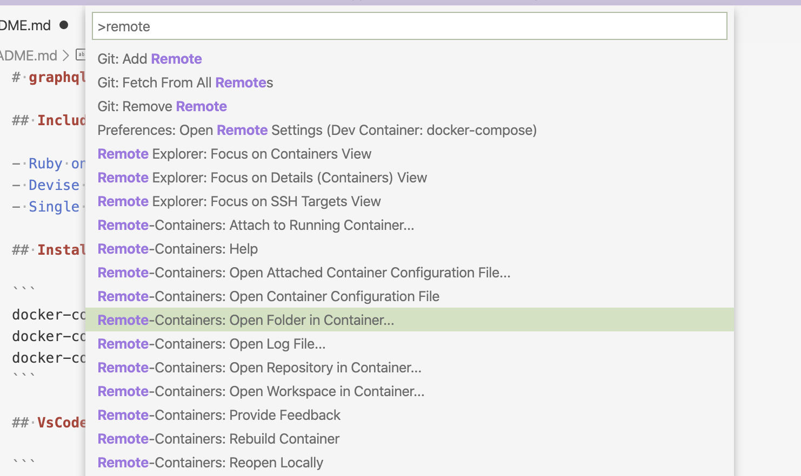

# graphql-ruby + devise + Single Page Application on Rails

[](https://github.com/shwld/graphql-ruby-on-rails-with-spa/actions)
[](https://circleci.com/gh/shwld/graphql-ruby-on-rails-with-spa)
[](https://graphql-ruby-on-rails-with-spa.herokuapp.com)

---

[](https://heroku.com/deploy?template=https://github.com/shwld/graphql-ruby-on-rails-with-spa)

## Includes

- Ruby on Rails
- graphql-ruby
- Devise authentication
- Single Page Application

more

[日本語](/docs/ja/README.md)

## Install

```
docker-compose build
docker-compose run --rm app bin/setup
```

## VSCode

```
code --install-extension ms-vscode-remote.vscode-remote-extensionpack
```

Open folder in container


